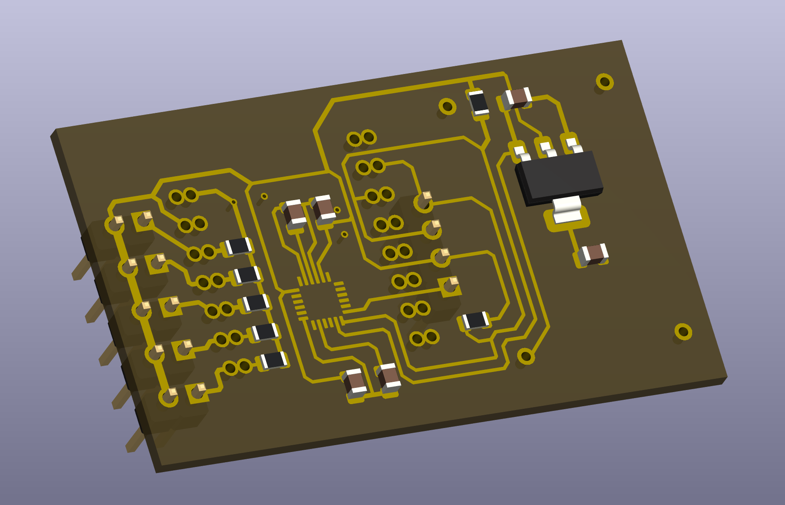
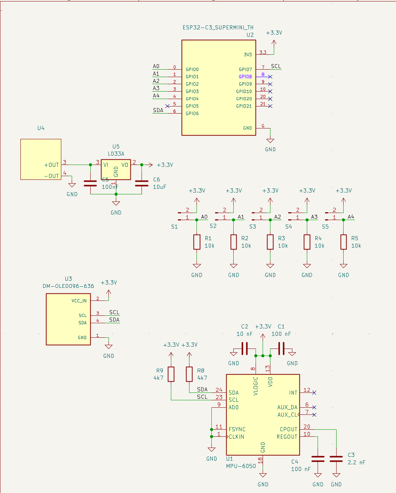
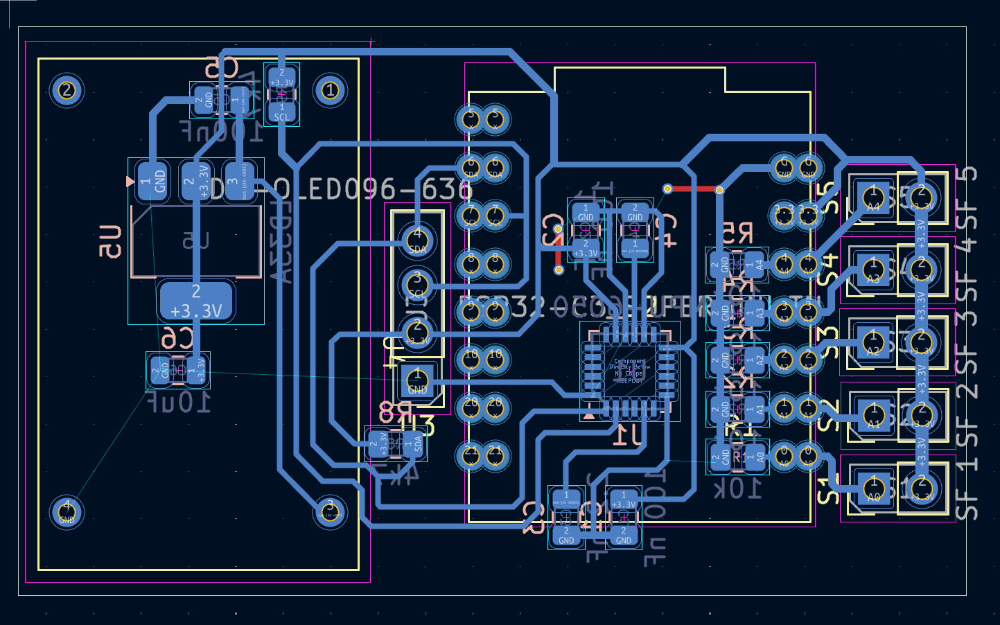
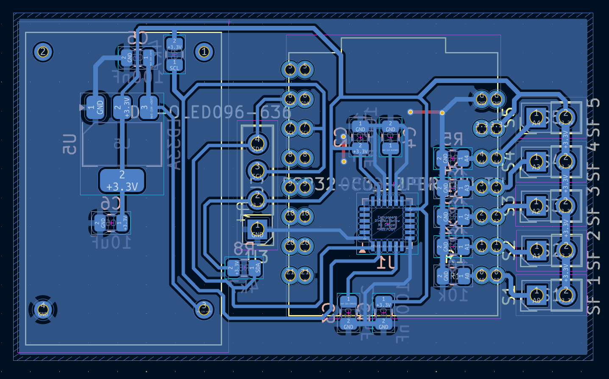
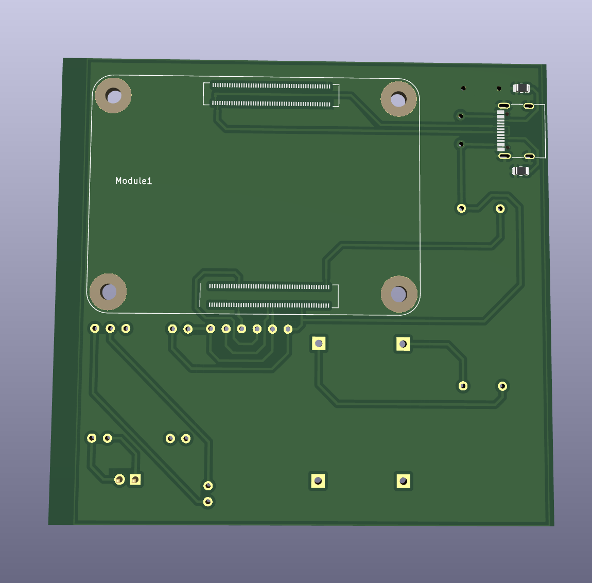
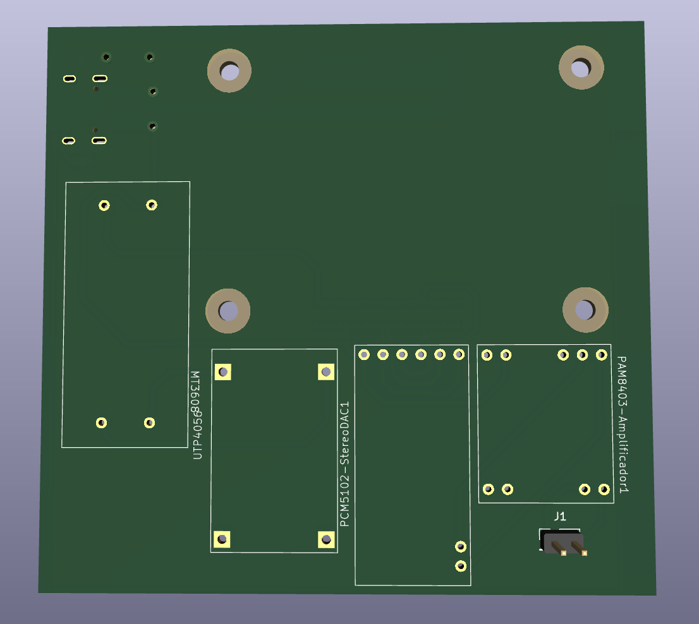

# Carpeta de Trabajo - Diseño de Placas 

Utilizamos **KiCad** para el diseño de circuitos impresos (PCB). Llevamos con esta aplicacion la creacion de dos PCBs:

## Módulo Muñeca

El diseño de la placa está optimizado en un formato compacto de 30 mm por 50 mm, lo que permite reducir al máximo su tamaño sin afectar el rendimiento. Su objetivo principal es garantizar un sensado preciso de los gestos de la mano, combinando comodidad de uso con eficiencia en la interpretación de movimientos. 

El módulo integra un ESP32-C3 Super Mini como microcontrolador central, acompañado por el chip MPU6050 para la detección de aceleración y giro, una pantalla OLED SSD1306 para la visualización de información en tiempo real, sensores flexibles que registran la flexión de los dedos y un módulo de carga USB que facilita la autonomía energética y la recarga de Batería Lipo. Gracias a esta integración, el sistema se presenta como una solución ligera, compacta y confiable para la captura e interpretación de gestos manuales.

- Diseño 3D:

- Esquemático

- Diseño de placa sin plano de masa

- Diseño de placa con plano de masa:

- Diseño 3D:

- Esquemático

- Diseño de placa sin plano de masa

