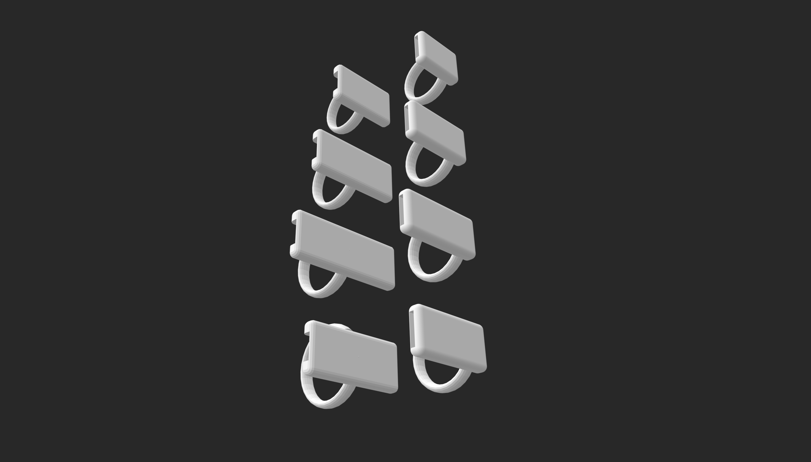

# 🧱 Diseño 3D del Prototipo – Rama de Modelado en Fusion 360 y Blender

Este README documenta todo el proceso de desarrollo del **prototipo 3D** del traductor de lengua de señas realizado en **Fusion 360** y **Blender**. Acá vas a encontrar desde los primeros pasos de aprendizaje hasta los resultados visuales obtenidos.

---

## 🧠 Objetivo

Diseñar un modelo tridimensional que represente de forma realista y funcional el traductor de señas que estamos desarrollando, tomando en cuenta:

- La posición de los componentes.
- La comodidad y portabilidad del diseño.
- La posibilidad de imprimir o replicar el prototipo.

---

## 🧪 Proceso de diseño

1. **Búsqueda de referencias**: fotos de guantes, muñequeras, soportes para sensores, cajas para placas PCB, etc.
2. **Boceto digital inicial**: siseñamos una base que sirviera como estructura para alojar sensores, placas y cables, sin incomodar al usuario.
3. **Modelado progresivo**: creamos las piezas por separado: muñequera, riñonera, soportes y cajas (pensadas para ser impresas en 3D), sensores, placas, etc.
4. **Texturizado y materiales**: aplicación de colores básicos para visualización.
5. **Renderizado final**: configuración de luces, cámara y fondo neutro para presentación.

## 🔨 Imágenes durante el proceso

  

  

  

  

  

---

## 🎥 Recursos de aprendizaje

Para aprender lo básico de Blender y Fusion 360, seguimos una serie de tutoriales introductorios que nos ayudaron a:

- Navegar por la interfaz.
- Crear y editar mallas.
- Usar modificadores como *Subdivision Surface* y *Mirror*.
- Exportar renders.

## 🖼️ Galería 

A continuación, algunas capturas de los modelos finales:

## Módulo Muñeca

  

## Módulo Pecho
  

## Soportes Anillos de Sensores Flex
  

### Videos de referencia durante el trabajo

| Título | Enlace | Duración |
|-------|--------|----------|
| 🧭 *Blender Básico en 15 minutos* | [Ver en YouTube](https://www.youtube.com/watch?v=TPrnSACiTJ4) | 15 min |
| ✋ *Cómo modelar una mano low poly* | [Ver en YouTube](https://www.youtube.com/watch?v=9RyBq10cTYE) | 25 min |
| 💡 *Luces y cámara para renders pro* | [Ver en YouTube](https://www.youtube.com/watch?v=O9zMt4KxPvs) | 18 min |
| 🛠️ *Tips de modelado para principiantes* | [Ver en YouTube](https://www.youtube.com/watch?v=VT5oZndzj68) | 10 min |
| 🔎 *Prototipo de referencia* | [Investigar](https://cdn.thingiverse.com/renders/6c/c7/28/d9/e9/5f9696f5e9e06889e206539301f295fb_display_large.jpg) |  |
---
