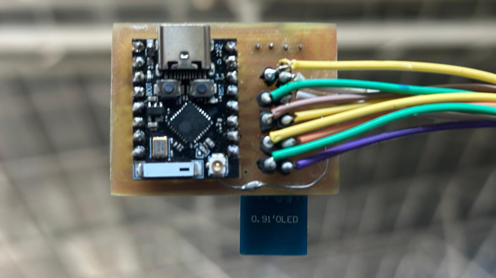

# Proyecto de Diseño de Placas con KiCad

Utilizamos **KiCad** para el diseño de circuitos impresos (PCB). Llevamos con esta aplicacion la creacion de dos PCBs:

- Modulo de la muñeca: el diseño de la placa esta adaptado a una medida de 35mm x 45mm, de forma que podamos hacer la placa lo mas simple posible para el funcionamiento y el sensado perfecto de los gestos de la mano. 

- Modulo del pecho: esta placa es el cerebro de SignaLink. La hemos llevado a cabo por la migracion a una Raspberry Compute Moduele 4. Dentro de ella, se encajaran los sensores necesarios para el filtrado de datos y permitir la comunación MQTT. 

