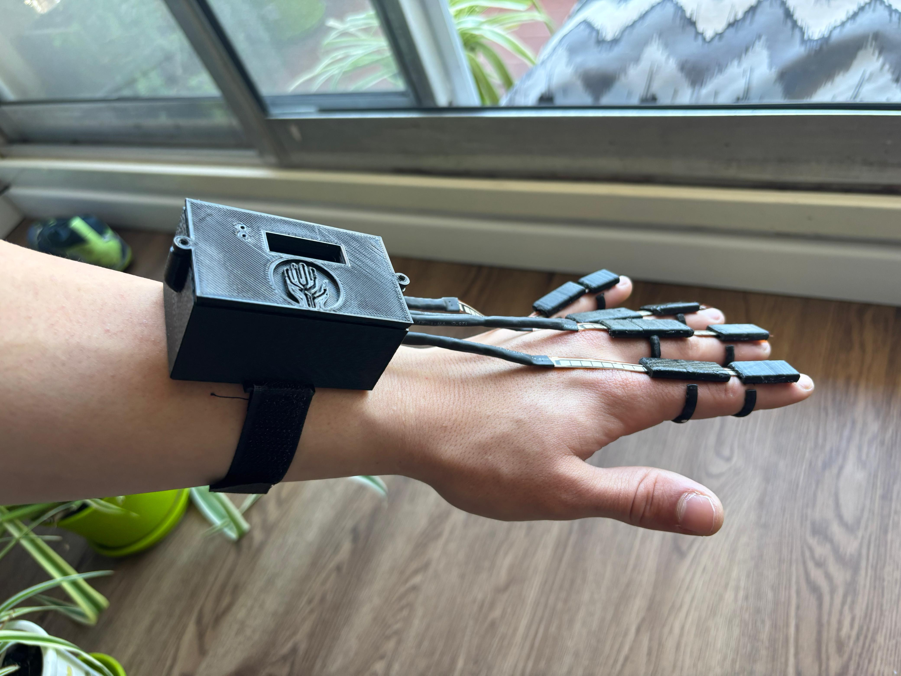

<div align="center">

</div>

<div align="center">

# Tus gestos hablan, SignaLink traduce

</div>

## 🔗 Acceso a página web:

https://signalink2025.com

<a href="https://github.com/albornozthiagoo/SignaLink-Web" target="_blank">
  
</a>

## 🗓️ Objetivo de Proyecto:

SignaLink tiene como objetivo principal traducir la lengua de señas para lograr la inclusión de personas sordas en el ámbito escolar.

## 🌎 Visión a futuro

Otro objetivo propuesto a largo plazo es seguir difundiendo esta idea en futuras generaciones para poder proveerles un mejor manejo en la vida cotidiana a este tipo de personas, permitiendole agilizar su vida social o simplemente la comunicación sin barerras con otras personas.

## 💭 ¿De dónde surgió la idea?

Esta idea surgió en una conversación con la bibliotecaria de nuestra escuela que nos dio a conocer cuan reservadas son estas personas en la sociedad y cuantos desafios deben afrontar a diario. A traves de todo esto planteamos posibles soluciones para facilitarle sus vidas inicialmente en las escuelas y asi empezo toda esta aventura.

## 🖐 Descripción del proyecto:

Nuestro proyecto esta principalmente equipado con sensores flex, giroscopos y acelerómetros que detectan los movimientos de los dedos.

Estos datos que arrojan los sensores son capturados por un ESP32 C3 Super Mini ubicado en la muñeca y enviados a un Computer module 4 (CM4) a traves de un sistema de mensajeria (MQTT) ubicado en el pecho/cintura. Esta CM4 integra una Inteligencia Artificial (IA) que se encarga de procesar estos datos recibidos para descubrir que gesto se intentó hacer. Una vez realizado este proceso se convertira mediante PIPER-TTS a formato audio reproducible por un parlante, permitiendo así que las personas que se comunican mediante la lengua de señas puedan expresar su mensaje de forma audible para que cualquier receptor lo comprenda.

En paralelo, un micrófono direccional se encargará de captar la voz de la persona que quiera comunicarse, esas palabras serán procesadas por la CM4 utilizando un modelo de reconocimiento de voz (Vosk -> Offline) y en forma de texto se mostrará finalmente a través de un LCD OLED (SSD1306)

<div align="center">

</div>

## 🛠️ Componentes a utilizar:

| Componentes                     | Links                                                                                                                                                                                                                                                                                                                                                                                                                                                                                                                                                                                                                                                                                                                                                                                            |
| ------------------------------- | ------------------------------------------------------------------------------------------------------------------------------------------------------------------------------------------------------------------------------------------------------------------------------------------------------------------------------------------------------------------------------------------------------------------------------------------------------------------------------------------------------------------------------------------------------------------------------------------------------------------------------------------------------------------------------------------------------------------------------------------------------------------------------------------------ |
| Raspberry Pi Compute Module 4   | [Raspberry Pi Compute Module 4 - ELEMON](https://www.elemon.com.ar/products/detail/code/AR681RA642)                                                                                                                                                                                                                                                                                                                                                                                                                                                                                                                                                                                                                                                                                              |
| ESP32-C3 Super Mini             | [ESP32-C3 Super Mini - Mercado Libre](https://articulo.mercadolibre.com.ar/MLA-1933180704-placa-desarrollo-esp32-c3-super-mini-wifi-bluetooth-sgk-_JM#polycard_client=search-nordic&position=18&search_layout=grid&type=item&tracking_id=a6179d80-9c2f-448f-931d-3f6b0744610e&wid=MLA1933180704&sid=search)                                                                                                                                                                                                                                                                                                                                                                                                                                                                                      |
| Sensores Flex                   | [Sensores Flex - Mercado Libre](https://articulo.mercadolibre.com.ar/MLA-621168012-flex-sensor-45-o-degrees-10-30-kohms-sensor-reflectivo-_JM#polycard_client=search-nordic&position=22&search_layout=stack&type=item&tracking_id=d09a116e-7fa9-4e61-b811-829b67d77fb1&wid=MLA621168012&sid=search)                                                                                                                                                                                                                                                                                                                                                                                                                                                                                              |
| Parlante                        | [ Mini Parlante- Mercado Libre](https://articulo.mercadolibre.com.ar/MLA-926965993-mini-parlante-mylar-50mm-8-ohms-05w-audio-arduino-nubbeo-_JM#polycard_client=search-nordic&position=8&search_layout=stack&type=item&tracking_id=5afdc171-789b-4858-9908-6e8644b818c2&wid=MLA926965993&sid=search)                                                                                                                                                                                                                                                                                                                                                                                                                                                                                             |
| Modulo Amplificador             | [ PAM8403 - Mercado Libre](https://www.mercadolibre.com.ar/mini-amplificador-digital-pam8403-audio-estereo-3w-nubbeo/up/MLAU237136317?pdp_filters=item_id:MLA872767061&matt_tool=93069454&matt_internal_campaign_id=345755545&matt_word=&matt_source=google&matt_campaign_id=22943760643&matt_ad_group_id=187007705242&matt_match_type=&matt_network=g&matt_device=c&matt_creative=774178775740&matt_keyword=&matt_ad_position=&matt_ad_type=pla&matt_merchant_id=5381779497&matt_product_id=MLA872767061&matt_product_partition_id=2424609165763&matt_target_id=pla-2424609165763&cq_src=google_ads&cq_cmp=22943760643&cq_net=g&cq_plt=gp&cq_med=pla&gad_source=1&gad_campaignid=22943760643&gclid=CjwKCAjwx-zHBhBhEiwA7Kjq67psJOORAgfFyvkqrNDuf2QOjtHhOilyAz1d6FZmyiqMh8wAA7Ma8xoCBCEQAvD_BwE) |
| Micrófono                       | [ Corbatero Carello C11 - Mercado Libre](https://www.mercadolibre.com.ar/microfono-inalambrico-corbatero-lavalier-carrello-c11-adaptador-usb-c-a-lightning-estuche-de-carga-antena-usb-c-1x-microfono-color-negro/p/MLA44118282)                                                                                                                                                                                                                                                                                                                                                                                                                                                                                                                                                                 |
| Baterias                        | [ Lipo 3.7V - Mercado Libre](https://articulo.mercadolibre.com.ar/MLA-823943306-bateria-litio-polimero-lipo-37v-1200mah-drones-helicopteros-_JM#polycard_client=search-nordic&position=11&search_layout=stack&type=item&tracking_id=00997a8f-a302-41cd-929e-7f9b96588b73&wid=MLA823943306&sid=search)                                                                                                                                                                                                                                                                                                                                                                                                                                                                                            |
| Sensor Giroscopo y Acelerometro | [MPU6050 - Mercado Libre](https://articulo.mercadolibre.com.ar/MLA-1464073846-acelerometro-giroscopo-mpu6050-6-ejes-gy-521-pic-arduino-_JM#polycard_client=search-nordic&position=4&search_layout=grid&type=item&tracking_id=1592b6fb-67c2-4128-a466-704776d0e915&wid=MLA1464073846&sid=search)                                                                                                                                                                                                                                                                                                                                                                                                                                                                                                  |
| Step Up 5V                      | [ MT3608 - Mercado Libre](https://articulo.mercadolibre.com.ar/MLA-1410408453-5-fuente-mt3608-step-up-buck-boost-elevador-dc-dc-28v-2a-_JM#polycard_client=search-nordic&backend_model=search-backend&position=20&search_layout=stack&type=item&tracking_id=d4915a5c-d355-42a4-b246-3798a3844913&wid=MLA1410408453&sid=search)                                                                                                                                                                                                                                                                                                                                                                                                                                                                   |
| LCD OLED                        | [LCD SSD1306 - Mercado Libre](https://articulo.mercadolibre.com.ar/MLA-1899526208-pantalla-display-oled-091-pulgadas-128x32-i2c-ssd1306-_JM)                                                                                                                                                                                                                                                                                                                                                                                                                                                                                                                                                                                                                                                     |

## 💻 Instalación y Uso

1. Clonar el repositorio:
   ```bash
   git clone https://github.com/impatrq/SignaLink
   ```
2. Entrar a la carpeta rpizero2W.
   ```bash
   cd SignaLink/rpizero2W
   ```
3. Darle permisos de ejecucion al script de instalación.
   ```bash
   chmod +x install.sh
   ```
4. Ejecutar el Script.
   ```bash
   ./install.sh
   ```
5. Comenzar su uso.

## 🧑🏽‍💻 Integrantes

| Integrantes           | Responsabilidades                     | Tareas Secundarias                 |
| --------------------- | ------------------------------------- | ---------------------------------- |
| Albornoz Thiago       | Gestión de Redes Sociales y Marketing | Desarrollo de Software             |
| Erbino Sebastián      | Diseño del Prototipo                  | Integración de hardware            |
| Franco Valentin       | Armado de Hardware                    | Instalación y conexión de hardware |
| Lesme Franco          | Armado de software                    | Diseño del prototipo               |
| Poggi Lorenzo         | Registro de Seguimiento               | Programación del sistema           |
| Sarniguette Valentino | Prueba electronica                    | Armado de circuitos                |

## 🤝 Colaboración:

Este es el comienzo de un prototipo realizado a base de nuestros conocimientos, si le gustaria formar parte de SignaLink, nos ayudaría su colaboración en:

- Perfeccionar el código.
- Mejorar la infraestructura tecnológica.
- Creación de manuales y realización de pruebas.
- Apoyo financiero para la investigación y el desarrollo.

## 📱 Contactanos:

 <div style="display: flex; justify-content: space-around;">

<a href="https://mail.google.com/mail/?view=cm&to=signalink2025@gmail.com" target="_blank">
    
</a>
<a href="https://www.instagram.com/signalink_">
    
</a>

## 📱 Contactos personales

### 1. Albornoz Thiago

<a href="https://mail.google.com/mail/?view=cm&to=albornozthiagoagustin@gmail.com" target="_blank">
    
</a>
<a href="https://www.linkedin.com/in/thiago-agustin-albornoz-6956b135b">
    
</a>

### 2. Erbino Sebastian

<a href="https://mail.google.com/mail/?view=cm&to=serbino25@gmail.com" target="_blank">
    
</a>
<a href="https://www.linkedin.com/in/sebasti%C3%A1n-erbino-25b9792ab?trk=contact-info">
    
</a>

### 3. Franco Valentin

<a href="https://mail.google.com/mail/?view=cm&to=valentinfranco2506@gmail.com" target="_blank">
    
</a>
<a href="https://www.linkedin.com/in/valentin-franco-174587357?utm_source=share&utm_campaign=share_via&utm_content=profile&utm_medium=ios_app ">
   
</a>

### 4. Lesme Franco

<a href="https://mail.google.com/mail/?view=cm&to=franco.lesme2006@gmail.com" target="_blank">
    
</a>
<a href="https://www.linkedin.com/in/franco-lesme-25bb4b259/us">
    
</a>

### 5. Poggi Lorenzo

</a><a href="https://mail.google.com/mail/?view=cm&to=lorenzo.poggijanin@gmail.com" target="_blank">

</a>
<a href="https://www.linkedin.com/in/lorenzo-poggi-6b9b5a357?utm_source=share&utm_campaign=share_via&utm_content=profile&utm_medium=ios_app">

</a>

### 6. Sarniguette Valentino

<a href="https://mail.google.com/mail/?view=cm&to=valentinosarniguette@gmail.com" target="_blank">
    
</a>
<a href="https://www.linkedin.com/in/valentino-sarniguette-156175354/">
    
</a>

---

 
